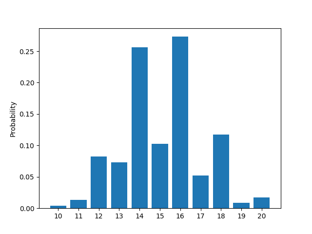

# Dice Tools 

Dice tools is a packaged designed for calculating discrete probabilistic distributions and their properties for dice 
based tabletop games such as d6 miniatures games and d20 RPGs. This quick guide will use a series of examples from the 
d6 miniatures game from [Warhammer 40K](https://warhammer40000.com/) 9th edition. 

## Prerequisites

Dice tools is designed to extend the functionality of [Lea3](https://bitbucket.org/piedenis/lea/src/dev_lea3/). Lea3 is 
a python package for calculating discrete probabilities of all forms. Like Lea3, it is recommended that users of Dice 
Tools also install matplotlib for full functionality. Users will find this package most useful if they are also familiar 
with the functionality of Lea3. 

## Installation 
```python
pip install dice_tools
```

## Example Use

Often times in dice games players will use the expected value/mean of a roll to analyse a situation. Alongside mean, 
this module makes it easy for users to extract data such as variance and standard deviation from a probability 
distribution, as well as to look directly at and plot the probability mass function (PMF).

#### Setup

```python
from dice_tools import *
import lea
from lea import leaf 
from lea import P
from lea.leaf import die 
```

#### Re-rolling Dice

Say for example that you would like to know the distribution of success on a roll of 10 six sided dice for three 
different scenarios. In the first scenario a success is defined as any roll of 4 or greater (4, 5, or 6) is defined as a
success. In the second scenario, the same criteria for success is defined, except the player may first re-roll any dice 
with the result of 1 before determining success. In the third example the player may re-roll and failed roll 
(1, 2, or 3) before determining the number of successes. The important thing to note here, is that all three scenarios 
are defined by [binomial distributions](https://en.wikipedia.org/wiki/Binomial_distribution). 

We can calculate each scenario with the following commands. 
```python
scenario_one = lea.binom(10, P(die() >= 4))
scenario_two = lea.binom(10, P(re_rolling(die(), 1) >= 4))
scenario_three = lea.binom(10, P(re_rolling(die(), [1,2,3]) >= 4))
```

Then we extract information from each object as we would any lea.Lea object. 
```python
(scenario_one.mean, scenario_two.mean, scenario_three.mean)
# -> (5.0, 5.833333333333334, 7.5)
(scenario_one.std, scenario_two.std, scenario_three.std)
# -> (1.5811388300841898, 1.5590239111558089, 1.3693063937629153)
```

#### Variable Number of Tests

Sometimes it is useful to find the probability of a value that *would* be a binomial distribution except the number of 
tests itself falls within a discrete distribution. To go with another Warhammer example, variable shots weapons follow
this pattern. If you wanted to know the probability of getting at least 4 hits with a weapon whose shots equaled the sum
of two six sided dies and which had a 50% probability of hitting each shot you could run the following code.  

```python
spread = variable_tests(die(6).times(2), 0.5)
P(spread >= 4)
# -> 0.47247314453125
```

About a 47% chance of landing at least 4 hits. 

#### Multi-Damage weapons / Capped Remainder Sums

In Warhammer 40K 9th edition there are many situations where the a multi-damage weapons, including variable damage 
weapons, are attacking into units with multi-wound models. This situation presents a complicated problem. Let's look at
the situation where a weapon that does between one and three damage (equally spread between possibilities) has wounded a
unit with two wound models. If a successful wound does two or three damage then an entire model is eliminated from the 
game, and we would count the two damage that was inflicted. However, if only one damage is inflicted then the model is 
left with only one health left for the next attack. This means that that next attack is capped at only one health. In 
summary, the expected result must take into consideration the permutation of the damage, NOT just the combination. 
Dice Tools provides a function to calculate the probability distributions up to a set number of damage dice for this 
situation. It returns a dictionary mapping the number of dice to the probability distribution of total damage. 

```python
table = variable_damage_table(10, die(3), 2)
table[1]
# -> 
# -> 1 : 0.3333333333333333
# -> 2 : 0.6666666666666666
table[10].plot()
```



#### Chaining Discrete Probabilities

To expand on the previous example, we also might want to know the damage spread when we don't know how many successful
hits we are going to land. We can combine a binomial distribution representing the successful wounds out of 10 attacks
that hit on a d6 roll of 3 or higher, wound on a roll of 2 or higher, and passes the targets armour on a 5 or less with 
the variable damage table using the following commands. 

```python
wounds = lea.binom(10, P(die() >= 3)*P(die() >= 2)*P(die() < 5))
combined = merge_distributions(wounds, table)
combined.mean 
# -> 5.680417549421119
combined.plot()
```


#### Using Dice Tools to Analyse Terminator profiles against Plague Marines

Two wound Plague Marines present a difficult unit to simulate attacks against. Each point of damage against a Plague 
Marine has a 1/3 chance of being ignored due to their ability "Disgustingly Resilient". Let's say we want to compare 
how Terminator Marines with a Power sword and Power fists fairs when compared against a Terminator Assault squads with
thunder hammers. 

The first terminator squad has two profiles in it, a sergeant with a power sword and four terminators with power fists. 
When charging the plague marines the sergeant will attack 4 times, each attack hitting on 3 or higher, wounding on 4 or
higher, passing through the armour save on a 6 or less, and inflicting a single wound for successful hit. Each wound 
can be simulated as a multi-damage attack between 0 and 1. Each squad member attacks 3 times hitting on 4s, wounding on
3s, passing armour saves below a 6, and inflicts 2 damage before the Plague Marine may try to ignore the damage. 

```python
power_sword_damage = lea.pmf({0: 1/3, 1: 2/3})
power_sword_potential = variable_damage_table(4, power_sword_damage, 2)
power_sword = merge_distributions(lea.binom(4, P(die() >= 3)*P(die() >= 4)*P(die() < 6)), power_sword_potential)
power_fists_damage = lea.binom(2, 2/3)
power_fists_potential = variable_damage_table(4*3, power_fists_damage, 2)
power_fists = merge_distributions(lea.binom(4*3, P(die() >= 4)*P(die() >= 3)*P(die() < 6)), power_fists_potential)
terminator_squad = power_sword + power_fists
terminator_squad.plot()
```


The second squad, the Terminator Assault Squad, is all armed with Thunder Hammers. The sergeant attacks 4 times and each 
terminator squad member attacks 3 times for a total of 16 attacks. Each attack hits on 4s, wounds on 3s, passes through
armour under a 5, and deals 3 damage before damage is ignored. Following the same pattern as above we arrive at:

```python
thunder_hammer_damage = lea.binom(3, 2/3)
thunder_hammer_potential = variable_damage_table(16, thunder_hammer_damage, 2)
assault_squad = merge_distributions(lea.binom(16, P(die() >= 4)*P(die() >= 3)*P(die() < 5)), thunder_hammer_potential)
assualt_squad.plot()
```


While these plots are pretty to look at, we can also compare the distributions more directly. 

```python
(terminator_squad.mean, assault_squad.mean)
# -> (4.802037835882868, 5.680092805368757)
(terminator_squad.var, assault_squad.var)
# -> (5.477760599140879, 8.314731770347208)
P(assault_squad >= terminator_squad)
# -> 0.6418799400007009
P(assault_squad > terminator_squad)
# -> 0.5321892339310291
```